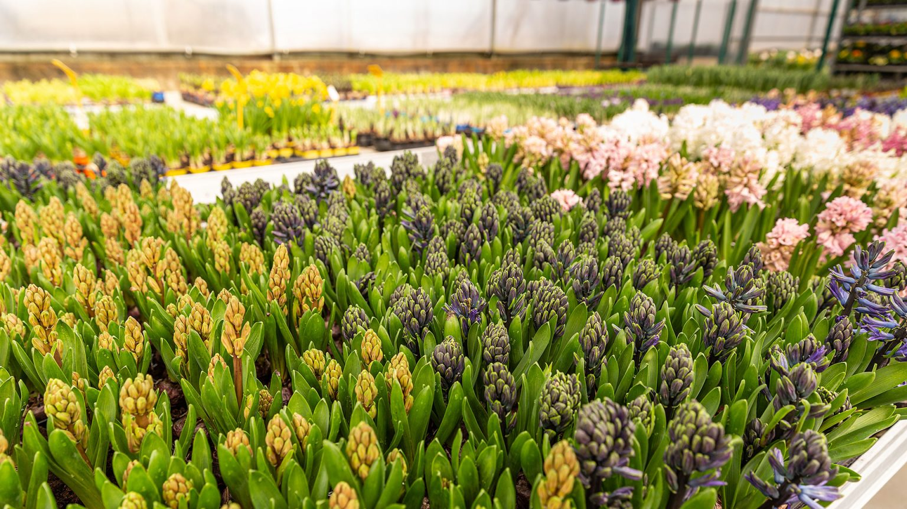
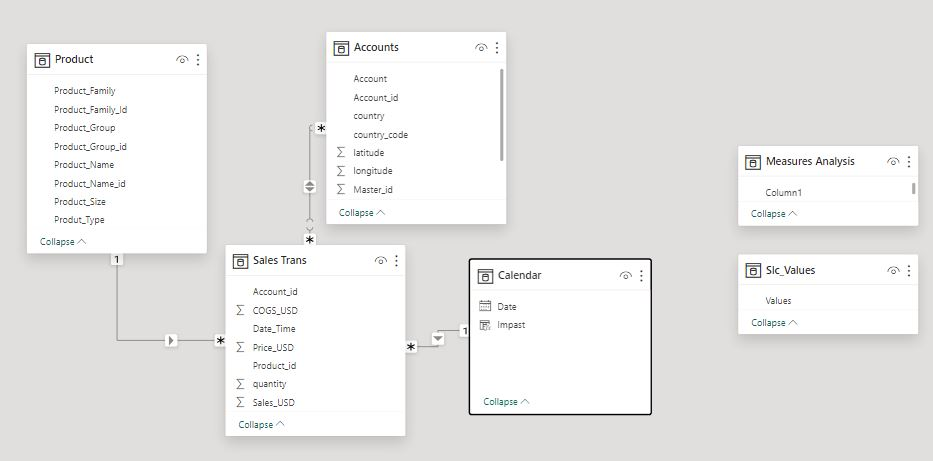
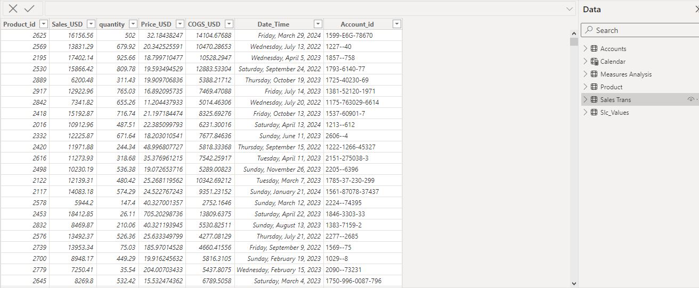
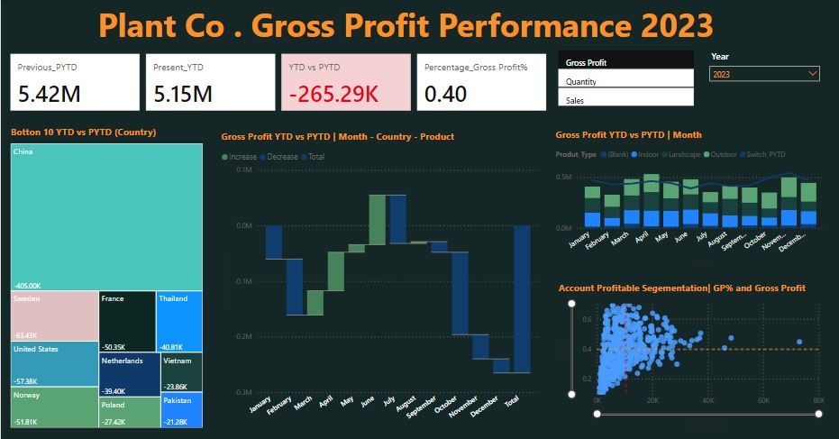
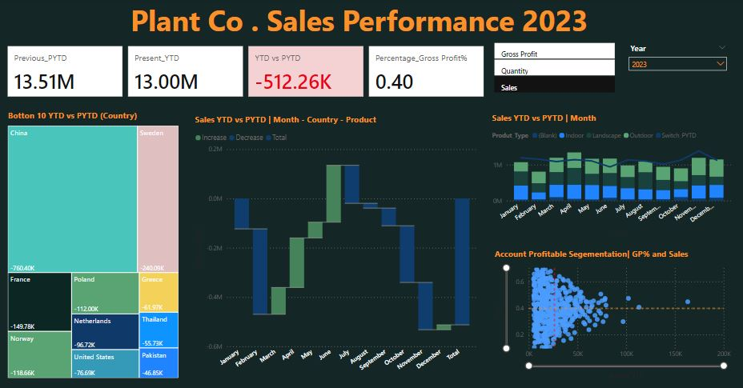

# The goal of this project is to investigate the performance of Global Green Distributors by Condensed ,dynamic performance report that utilizes switch measures and conditional formatting for recommendations of a solution for the greener future. 
Overcoming Global Botanical Distribution Challenges: Innovative Solutions for a Greener Future

           |    
:----------------------------------------------------------:|:----------------------
             Logistics Network                                                      Product Distribution

**Global Green Distributors(PLANT CO) is a premier supplier dedicated to providing a diverse range of high-quality botanical products to customers worldwide**. **Our commitment to excellence and sustainability has positioned us as a trusted partner in the horticultural industry**. **We connect nature enthusiasts, landscapers, and horticulturalists with plants that enhance the beauty of green spaces, promote environmental sustainability, and support biodiversity**.

Now that they’ve hired a new data team and are strategizing their transactional pipeline for the year, the company would like to build more understanding of the effectiveness of each countries on the Revenue generated and ROI  and how they relate to Sale and Quantity of product . 
The Dashboard is  to drive two primary objectives: 1) To condensed,dynamic performace to utilize switch measure and conditional formating, and 2) to find an innovative solution to overcome global distribution challenges.

## Dataset Structure
The dataset consisted of three tables, including information about Fact , Transaction and Account, as well as claims filed by product and related claim information.

           |    
:---------------------------:|:----------------------
              Modelling                                                                  Data   Transformation
              

## Insights Summary
#### In order to evaluate  performance and revenue growth, we focused on the following key metrics:

#### To condensed,dynamic performace to utilize switch measure and conditional formating here are what the Stakeholder require to be on the Report Dashboard,

- **Sales Growth Rate**: Measure the percentage increase in sales over a specific period. This helps to identify trends and the overall growth trajectory of the company. 
- **Average Order Value (AOV)**: The average amount spent by customers per transaction. Increasing AOV can significantly boost revenue..
- **%Gross Profit**: This is ratio of Gross Profit to Sale Revenue. Higher gross margins indicate better profitability and revenue growth.
- **Geographic Revenue Distribution**: The difference between sales and the cost of goods sold (COGS). Higher gross margins indicate better profitability and revenue growth.
- **Customer Acquisition Cost (CAC)**: The difference between sales and the cost of goods sold (COGS). Higher gross margins indicate better profitability and revenue growth.

           |      
:---------------------------:|:----------------------
                 Profit Analysis                                                        Quantity Analysis    

### To find an innovative solution to overcome global distribution challenges here are practice i want the operation and distribution department to look into on how to improve sale and standard out from compatitor this was draft from frequently  question ask by customer .

### Logistical Complexities:
- Problem: Distributing botanical products globally involves complex logistics, including handling perishable goods, ensuring timely delivery, and navigating international regulations.
- Solution: Implement advanced supply chain management systems, partner with reliable logistics providers, and maintain robust compliance with international regulations to streamline 
  operations.
  
### Maintaining Plant Health:
- Problem: Ensuring that plants remain healthy and viable during transportation is a significant challenge.
- Solution: Invest in state-of-the-art packaging and transportation methods that regulate temperature and humidity, and develop partnerships with horticultural experts to continually 
  improve plant care techniques.

### Sustainability Concerns:
- Problem: Balancing the demand for botanical products with the need to protect natural resources and ecosystems can be challenging.
- Solution: Adopt sustainable sourcing practices, support and collaborate with eco-friendly growers, and invest in research for sustainable horticultural practices.

### Market Competition:
- Problem: The horticultural industry is highly competitive, with numerous players vying for market share.
- Solution: Differentiate through exceptional product quality, innovative offerings, and superior customer service. Build strong relationships with customers and partners to foster 
  loyalty and trust.

### Regulatory Compliance:
- Problem: Navigating the varying agricultural and import regulations across different countries can be complex.
- Solution: Establish a dedicated compliance team to stay updated with international regulations and ensure that all shipments meet the necessary legal requirements.

## Dashboard
The dashboard can be found in Power BI  [here](https://app.powerbi.com/view?r=eyJrIjoiODVmMWY5NWMtZTA5NC00ZDA2LTg1ZTEtODY5NjM1ZjJkYzhkIiwidCI6ImRmODY3OWNkLWE4MGUtNDVkOC05OWFjLWM4M2VkN2ZmOTVhMCJ9). This dashboard enables manager and the stakeholders to filter by Sale,Quantity,Gross Profit, Product Type, and Country, and focuses on trends and values in Product metrics, Sales metrics, and Quantity metrics.

         
Dashboard Analysis           
